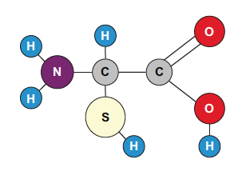

# Module 1: Molecular Fundamentals & Graph Representations

## 1. Introduction: The Graph Nature of Molecules
In chemistry and molecular sciences, a prominent problem has been representing molecules in a general, application-agnostic way and inferring possible interfaces between molecules, such as proteins. The molecules representation is essentially graph structures:
- **Nodes ($V$):** Represent individual Atoms (Carbon, Nitrogen, Oxygen, etc.).
- **Edges ($E$):** Represent Atomic Bonds.



*Figure 1.1: Visualizing how a caffeine molecule translates into a mathematical graph object.*
## 2. GNNs vs. Traditional "Fingerprints"
Traditionally, molecular properties were determined using "fingerprint" methods. These required domain experts to create manual features based on the presence or absence of specific sub-structures. 

**Why GNNs are better:**
GNNs learn **data-driven features**. They can group molecules in unexpected ways and propose new synthesis routes. This is critical for predicting:
- **Toxicity:** Is the chemical safe for human use?
- **Efficacy:** Does it have the intended biological effect on disease progression?

Drug discovery, especially for GNNs, can be understood as a **graph prediction problem**. Graph prediction tasks require learning and predicting properties of the entire graph. In drug discovery, the aim is to predict properties such as toxicity or treatment effectiveness (discriminative) or to suggest entirely new compounds to be synthesised and tested (generative). To suggest these new graphs, drug discovery methods often combine GNNs with other generative models such as variational graph autoencoders (VGAEs). 


*Figure 1.2: A GNN system used to predict new molecules. The workflow here starts on the left with a graph representation of a molecule. In the middle parts of the figure, this graph representation is transformed via a GNN into a latent representation. The latent representation is then transformed back to the molecule to ensure that the latent space can be decoded (right).*

Moreover, the representation of molecules captures the inherent sparsity of molecular structures, where most atoms form only a few bonds, and large portions of the molecule may be distant from each other in the graph. Traditional machine learning methods often struggle to predict properties of new molecules due to this sparsity, as they don’t account for the full structural context. GNNs overcome these challenges by capturing both local atomic environments and global molecular structures. GNNs learn hierarchical features from fine-grained atomic interactions to broader molecular properties,
and their ability to remain invariant to the ordering of atoms ensures consistent predictions. By leveraging molecular graph structure, GNNs make accurate predictions from sparse, connected data, thereby accelerating the drug discovery process.

## 3. Molecular Data Formats: SMILES & ZINC
To process molecules in Python, we use the **SMILES** (Simplified Molecular Input Line Entry System) format. SMILES represents molecular graphs in ASCII format.

**The ZINC Dataset:**
Our training usually involves the ZINC dataset (~250,000 molecules), which includes:
1. **logP:** The water-octanol partition coefficient (measures solubility).
2. **SAS:** Synthetic Accessibility Score (how hard is it to make?).
3. **QED:** Quantitative Estimate of Druglikeness (the "gold standard" for how much a molecule looks like a potential drug).

## 4. The GNN Workflow for Drug Discovery
As illustrated in **Figure 1.12 (Page 19)**, the workflow consists of an **Encoder** that transforms the molecular graph into a **Latent Representation** (a vector of numbers). This representation is then used to predict properties or "dream" of new molecules via a **Decoder**.

---

## 💻 Implementation: Converting SMILES to Graphs
The following implementation uses **RDKit** and **PyTorch Geometric** to convert a SMILES string into a GNN-ready Data object.

### Listing 5.17: SMILES to Graph Function (Page 179)
```python
from torch_geometric.data import Data
import torch
from rdkit import Chem

def smiles_to_graph(smiles, qed):
    # Load molecule from SMILES string
    mol = Chem.MolFromSmiles(smiles)
    if not mol: return None
    
    # Extract Edges and Bond Features
    edges = []
    edge_features = []
    for bond in mol.GetBonds():
        edges.append([bond.GetBeginAtomIdx(), bond.GetEndAtomIdx()])
        # Encoding bond types (Single, Double, etc.)
        bond_type = bond.GetBondTypeAsDouble()
        bond_feature = [1 if i == bond_type else 0 for i in range(4)]
        edge_features.append(bond_feature)
        
    # Convert to Tensors
    edge_index = torch.tensor(edges, dtype=torch.long).t().contiguous()
    x = torch.tensor([atom.GetAtomicNum() for atom in mol.GetAtoms()], 
                     dtype=torch.float).view(-1, 1)
    
    return Data(x=x, edge_index=edge_index, qed=torch.tensor([qed]))
